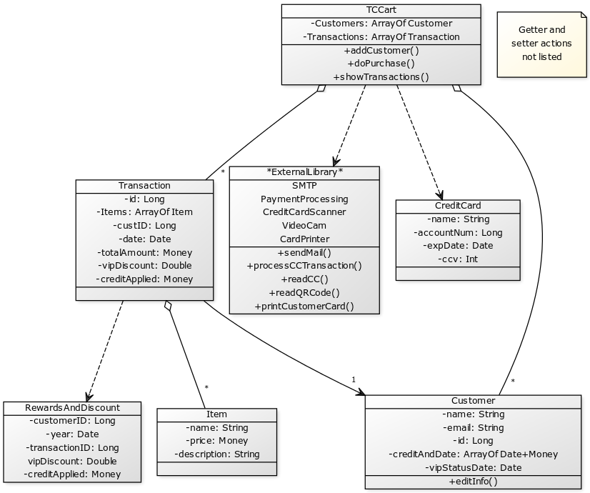
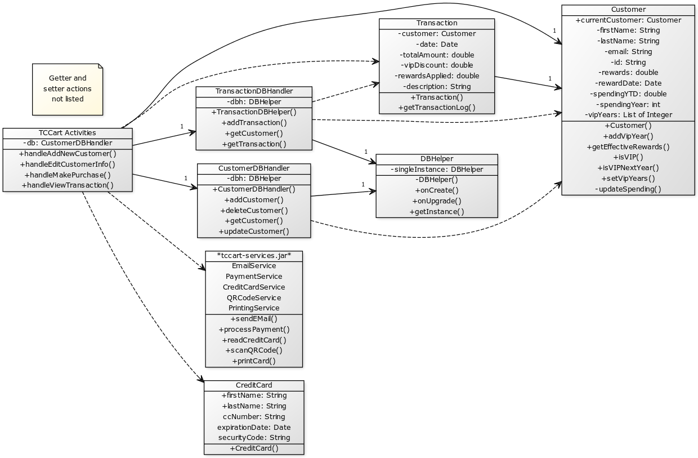

# TCCart Team Design Discussion

**Author**: 6300Spring16Team54

| Version | Description     |
| --------|:---------------:|
| V1      | Initial version |
| V2      | Revised version to show updated UML based on final android implementation|

## 1. Pros and Cons of Individual Design

### Design 1 - pcassell3

#### Pros
 - The deign is short and sweet. The implementation would be much easier with a simple class definition and direct function calls.

 - The single TCCart class performs the tasks such as printCustomerCard() and sendMail().

#### Cons
 - The design is clear yet some of the details are missing. 

 - The relationship between classes are ambiguous in the UML class diagram. 

### Design 2 - rharibabu3

#### Pros
 - The Item, Customer, Rewards, Purchase, and Transaction class each have a associated ID (i.e., ItemID, CustomerID, PurchaseID, and TransactionID) to identify itself. This provides a very convenient way to refer the instance. Moreover, the design is easier to be implemented in the database.

 - The design contains two types of manager, i.e., Utility Manager and Cart Manager to control external utility functions and maintain transaction information, respectively. Separate Utility Manager from Cart Manager improves maintainability. 

#### Cons
 - This UML class diagram indeed has sufficient infomation for us to understand the design. However, it may be better to add details in relationship between classes (e.x. a relationship between transaction class and purchas class).  

 - The proposed relationship between classes may not be well defined from the class diagram. For example, Rewards cannot exist without belonging to the Customer class.

 - Customer (class) need to require Manager (class) to edit their own information. It would be more convenient if the design lets the customer to update their own information. 

### Design 3 - fwu35

#### Pros
 - The relationships between classes are well defined. The logic and functions of classes are very clear to understand/implement.

 - The classes are provided with all necessary attributes and well-represented functional relationships. The UML diagram help developers to clearly understand the design and how function calls happen.

#### Cons
 - Since the Manager class provides the function calls such as addCustomer and ProcessTransaction, it may be a convenient approach to store arrays of transactions also in this class.

 - The design can provide an Item class to provide descriptions of Items purchased, while storing such information separately in different class is also an acceptable solution.

 - The classes (such as Customer and CustomerCard) maybe grouped together to reduce the number of classes. 

### Design 4 - rzhang360

#### Pros
 - The structure are the same as others and the design is clear. For example, a relationship between Store and Customer is well represented.

 - The classes are grouped together as much as it can be.

#### Cons
 - The functions that use external library are specified inside the class. The design lumps many methods inside the customer class, yet methods like printCard and sendEmail are called by the system, not the real customers.

 - Item needs more attributes such as name, amount, etc.

## 2. Team Design - Initial

### Commonalities
 - The structure of class design are mostly same among our group. This is very expected as the design is all about customer-purchase-item activities.

 - All of us use Manager class (i.e., TCCart in Design 1, Cart Manger in Design 2, Manager in Design 3, and Store in Design 4) to take control the most of tasks.

 - Most of us call the utility function outside the class.

 - Most of us represent item in a class, although not stated in project requirement document.

### Differences
 - We define and treat the relationship between classes differently. 

 - We treat reward differently, either as single class or attributes inside the class.

 - How we calculate discount and credit is different. It is interesting to know how many ways we have to derive the correct discount applied to each purchase.

### Decision and Rationale
 - We decide to use Design 1 as template for our group design and UML class diagram. It doesn't necessarily mean that other diagrams are not good. We want to use one major design principle instead of hybrid so that we can be consistent in the future design. 

## 3. Team Design - Final

### Decision and Rationale
This UML diagram represents the final design.  The structure is similar to what we have above and what was chosen from the beginning
however, due to the android architecture and how we chose to store data, some changes had to be made.

- We chose to use an SQLite data storage architecture.  This change the way we used data classes and accessed stored informatoin.

- tccart-services.jar when provided, contained different method names

- We chose to represent all android UI "Activity" classes as "TCCart Activities" in our UML for clarity.  Note that there are many more methods under each "Activity" that we did not include in the UML diagram just for brevity / clarity sake.  We assumed the high level activity name would be sufficient enough to show the relationships.  If we added the additional methods you would see additional relationships such as "MakePurchaseActivity -> CreditCard".

- The architecture is more complex, and this could be avoided in the future by using a different data storage methodology.  But this implementation would scale better.

## 4. Summary
 - We learned how to discuss project questions in groups.
 
 - We worked as a team to complete this task. 
  
 - We have learned how to perform design for the software development.

