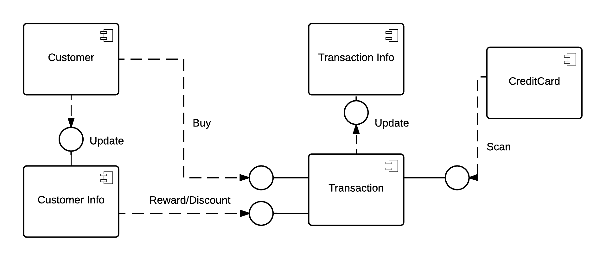
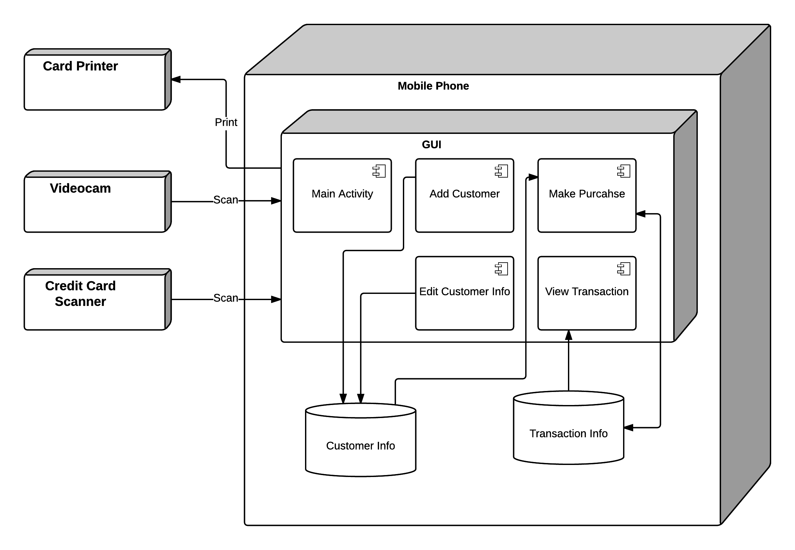
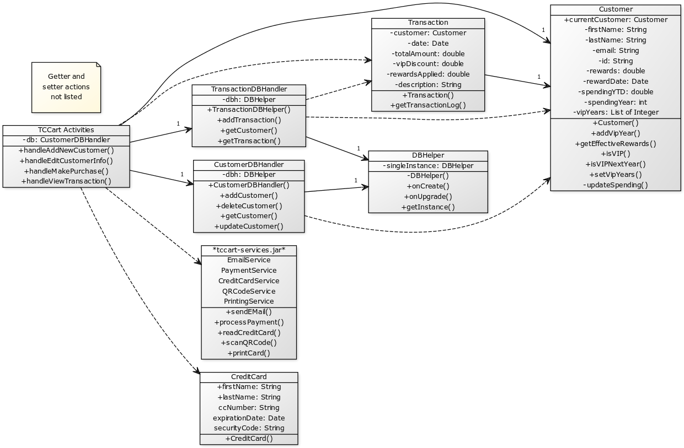
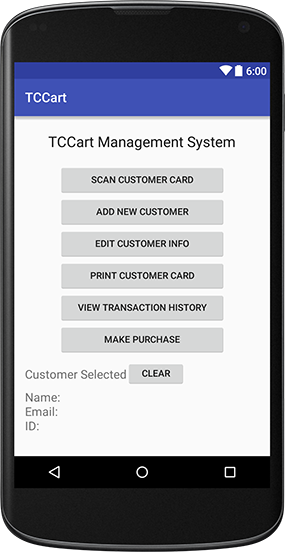
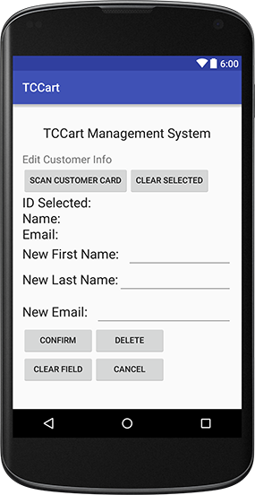
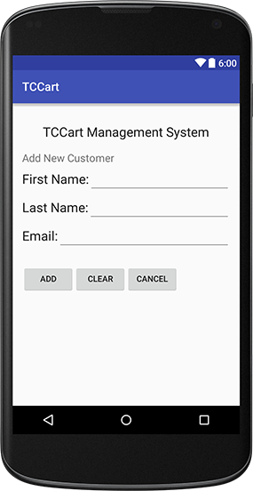
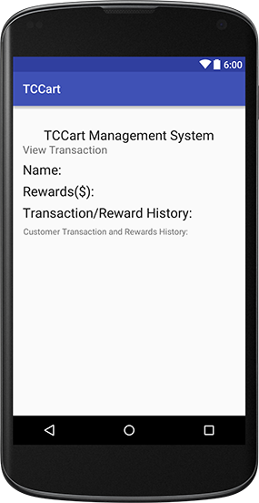

# Design Document

**Author**: 6300Spring16Team54

| Version | Description     |
| --------|:---------------:|
| V1      | Initial version |
| V2      | Revise version, Updated png, Sections 2 and 3 based on better understanding of the system |
| V3      | Revise version, Updated Sections based on better understanding of the system |
## 1 Design Considerations

### 1.1 Assumptions

The purpose of developing the Android app *TCCart* is to provide a payment and reward managment system in a timely manner to help our contractor's coffee and tea selling bussiness grow. To develop TCCart, we made the following assumptions:

- The software is Android app that runs on minimum target at API Level 23 (Mashmallow).

- The software is dependent on Android utilities for printing, QR code scanning, credit card scanning,  payment processing, and email sending, which are provided by our contractor and used as-is.

- We assume the hadware is sufficient for the basic function to perform (for example, sufficient storage to save customer info). 

- We assume the payment will be processed only for credit card, no cash allowed. 

- We assume the general credit/discount rule will be strictly applied to each transactions as described, no other special rule will be employed.

### 1.2 Constraints

- The current design for TCCart requires the system runs on mobile phone. Thus, the neceesary functions need to
be robust and able to handle common situations(/failures) within a mobile environment.

- The priciple of Unified Software Process will be used in designing the solution.

### 1.3 System Environment

| Requirements | Description     |
| --------|:---------------:|
| Android     | 6.0 and up |
| Permissions     | Photos/Media/Files, Storage, other |

## 2 Architectural Design

### 2.1 Component Diagram

### 2.2 Deployment Diagram

## 3 Low-Level Design

### 3.1 Class Diagram

## 4 User Interface Design

- Start Interface

- Customer Info

- Transaction

- View Transactions

