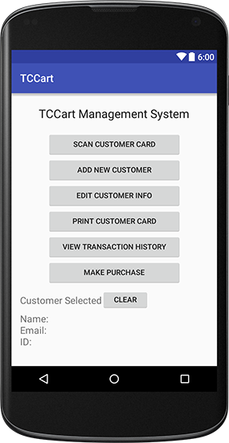
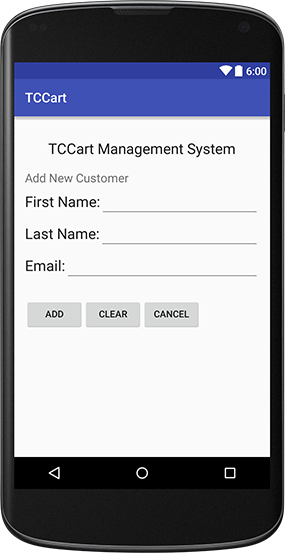
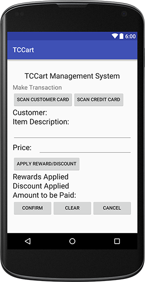

# **User Manual -- Team 54**

| Version | Description     |
| --------|:---------------:|
| V1      | Initial version |

##1 General Information
The "TCCart" project aims to develope a payment and rewards system for coffee and tea carts. 
The project will be developed for the Android platform.

##2 Using the Program 
###2.1 Getting Started

####2.1.1 Add Customer

- In  *Main Manu*, Click *ADD NEW CUSTOMER*.
- In  *Add New Customer*, type in Fist Name, Last Name, and Email.
  - Click *ADD*, add the new customer information, and a **Customer card** associated with current ID will be printed,
  - Click *CLEAR*, clear any current inputs,
  - Click *CANCEL*, return to the previous *Main Manu* Screen. 
  
####2.1.2 Edit Customer Information

- In  *Main Manu*, Click *EDIT CUSTOMER INFO*.
- In  *Edit Customer Info*, Click *SCAN CUSTOMER CARD*. The customer information including ID, Name, and Email will appear.
- To change the customer information, type in New Fist Name, New Last Name, and/or New Email. 
  - Click *CONFIRM*, the new customer information will be saved, 
  - Click *DELETE*, the existing customer information will be delete. 
  - Click *CLEAR FIELD*, clear nay current inputs,
  - Click "CANCEL*, return to the previous *Main Manu* Screen.

####2.1.3 Print Customer Card (copy)
- In  *Main Manu*, Click *SCAN CUSTOMER CARD* and scan the customer card, the customer informatin will appear below
  - Click *PRINT CUSTOMER CARD*, a customer card associated with scanned customer will be printed,
  - Click *CLEAR*, the customer information will be clear, and the manager can re-scan the customer card.
  
####2.1.4 Make Purchase

- In  *Main Manu*, Click *MAKE PURCHASE*.
- In  *Make Transaction*, Click *SCAN CUSTOMER CARD* to get the customer information, and Click *SCAN CREDIT CARD* to get payment.
  - Manually type in item for sale and its price,
  - If customer card is scanned, the customer name will appear, Click *APPLY REWARD/DISCOUNT* to apply any credit/discount qualified for customer,
  - Click *CONFIRM*, the purchase will be proceed and credit card will be charged,
  - Click *CLEAR*, will clear any current inputs including any items, customer and credit card information.
  - Click "CANCEL*, return to the previous *Main Manu* Screen.
  
####2.1.5 View Transactions

- In  *Main Manu*, Click *SCAN CUSTOMER CARD* and scan the customer card. Then, Click *VIEW TRANSACTION HISTORY*.
- In  *View Transaction*, The customer name, rewards and transaction will appear.

  

